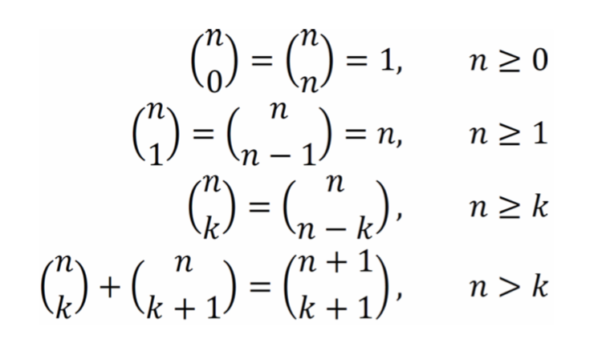

# ADDA. Java
Prácticas con Java de la asignatura Análisis y Diseño de Datos y Algoritmos (Universidad de Sevilla).

## Práctica 1

- **Ejercicio 1** (EJ.38): Dado un entero *n* obtener un lista con sus divisores.
- **Ejercicio 2** (EJ.11): Dada una lista de puntos, agrupar los puntos por cuadrantes, devolviendo un ListMultimap en el que se asocie a cada cuadrante los puntos que están en él.
- **Ejercicio 3** (EJ.21): Encontrar la inversa de una cadena de caracteres.

## Práctica 2

- **Ejercicio 1** (EJ.60): Generar la lista de los cuadrados de los números primos hasta un número dado.
- **Ejercicio 2** (EJ.53): Dadas dos listas de números reales del mismo tamaño, decidir si los incrementos del valor almacenado en cada posición con respecto a la anterior son del mismo signo en ambas listas para todas las posiciones.

## Práctica 3

- **Ejercicio 1** (EJ.68): Diseñar un algoritmo que calcule los valores de la recurrencia  ``F(n) = 2 * F(n - 1) + 3 * F(n - 2) - F(n - 3) con F(2) = 1, F(1) = 1, F(0) = 2``  Realizar el cálculo de los valores de recurrencia de abajo a arriba. Proporcionar una solución:
    - Recursiva no final sin memoria en C.
    - Iterativa (usando while) en C.
    - Recursiva final en C.
    - Recursiva no final con memoria en C.
- **Ejercicio 2** (EJ.70): Diseñar un algoritmo para el cálculo de un número combinatorio a partir de la siguiente definición:

Proporcione una solución:
    - Recursiva no final sin memoria en Java.
    - Recursiva no final con memoria en Java.